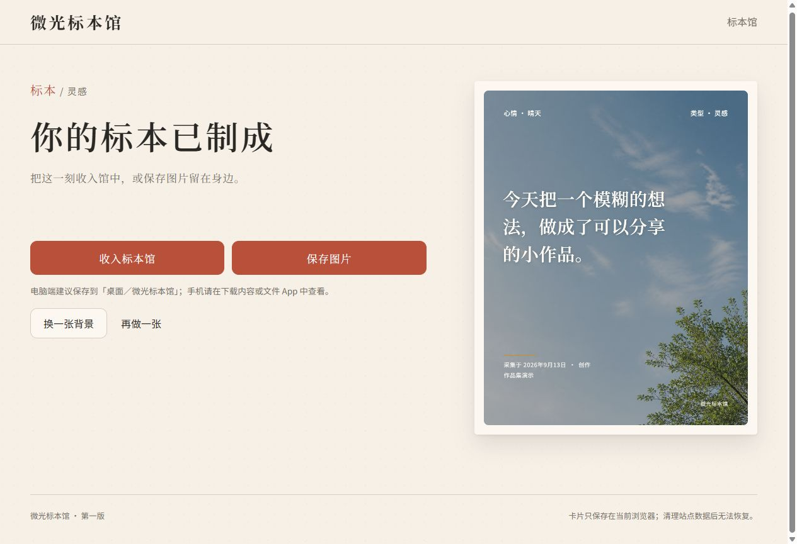
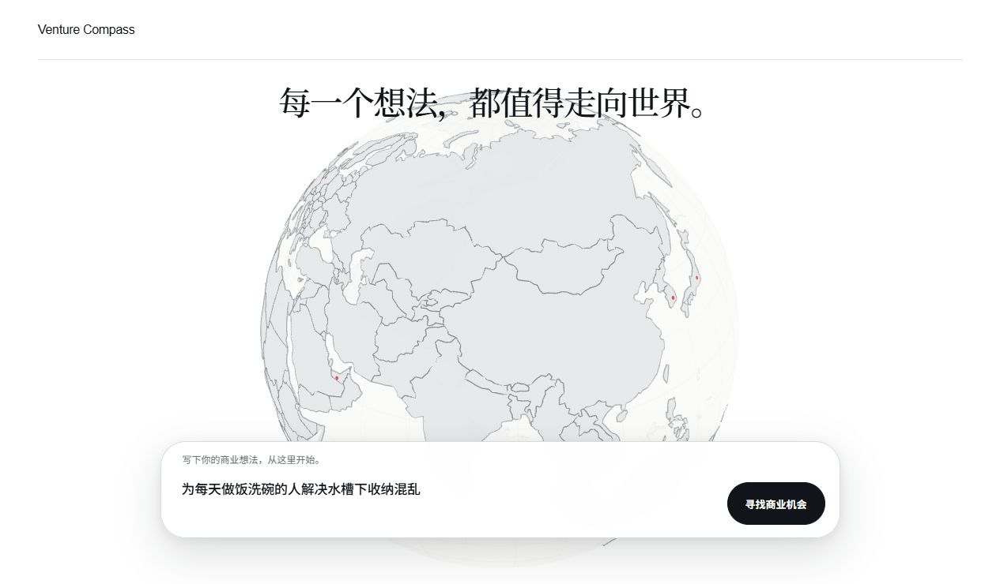
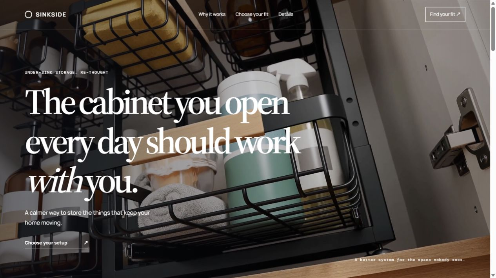
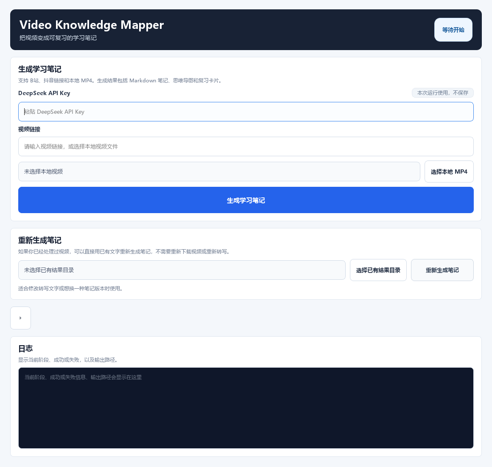
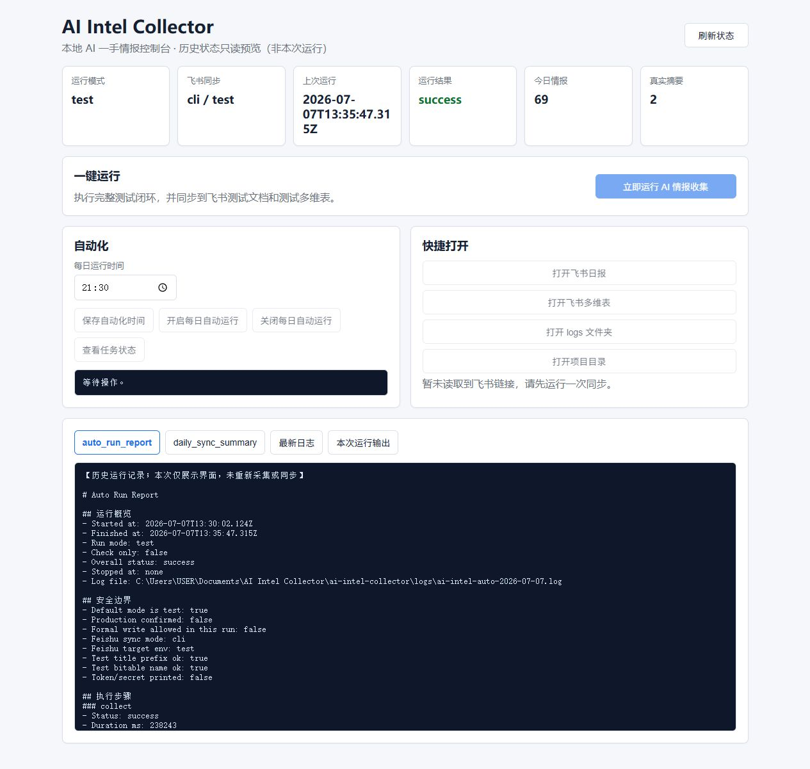
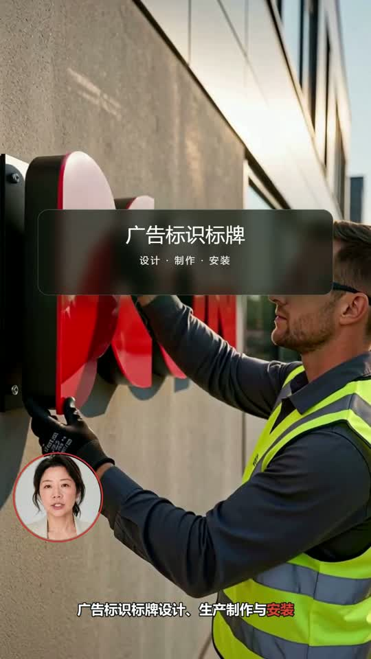
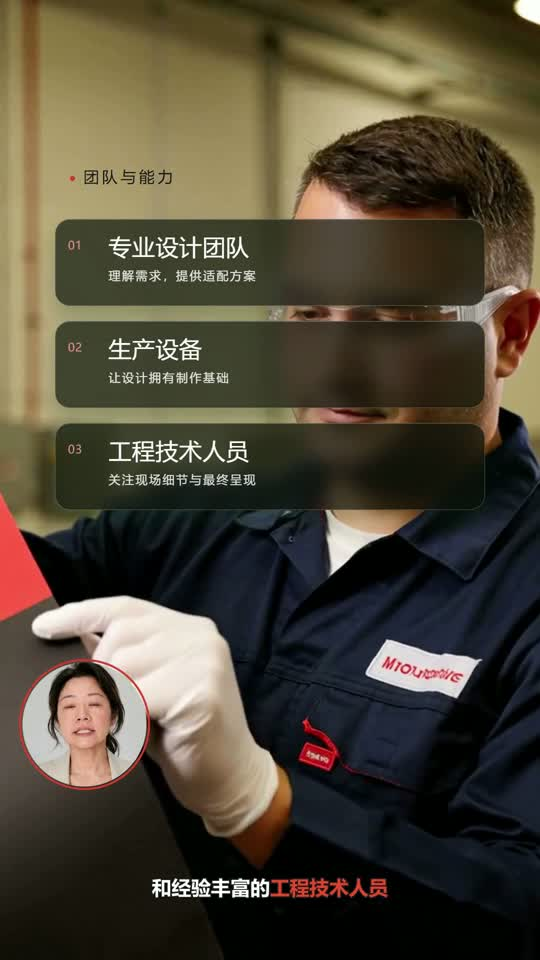

# CY · 项目作品集

我通过 AI Agent 与 Vibe Coding 开展项目实践，关注信息自动化、知识整理、网页交互与 AI 视频制作。这份作品集收录五个项目的源码、界面截图、运行方式和验证记录。

| 项目 | 主要内容 | 代码与说明 |
| --- | --- | --- |
| **微光标本馆** | 灵感制卡、图片导出、本机收藏与月度回看 | [在线体验](https://glimmer-specimen-museum.vercel.app/) · [项目与源码](glimmer-specimen-museum/README.md) |
| **商机罗盘 Venture Compass** | 比赛网页：3D 全球市场地球、想法输入、转场动画与产品概念展示 | [查看项目](venture-compass/README.md) · [源码](venture-compass/source/) |
| **Video Knowledge Mapper** | 视频内容获取、转写、结构化笔记、思维导图与复习卡片 | [查看项目](video-knowledge-mapper/README.md) · [源码](video-knowledge-mapper/source/) |
| **AI Intel Collector** | 多来源 AI 信息采集、正文提取、摘要、日报与桌面控制台 | [查看项目](ai-intel-collector/README.md) · [源码](ai-intel-collector/source/) |
| **企业数字人视频** | 53 秒成片、技术路径、创作思路、生成任务脚本与合成工程 | [查看项目](digital-human-video/README.md) · [观看成片](digital-human-video/video/enterprise-digital-human-v3.mp4) |

## 01 · 微光标本馆

**[在线体验 · 朋友测试版](https://glimmer-specimen-museum.vercel.app/)**

把一句话、一个灵感或片刻感受制成 4:5 标本卡，收藏到浏览器内的标本馆，再按月份回看。我负责产品定位与首版范围，通过 Codex 协作推进设计、实现与验证。

**技术栈：** React、TypeScript、Vite、Canvas、IndexedDB。正文与心情两步输入，6 种心情与 18 张预置背景，1080×1350 图片输出及月度馆藏。

**产品思路：** 优先做顺畅的制作与回看流程；可选标注减少输入负担，预置素材保持风格一致，本地存储让首版无需登录与后端。

**状态：** 2026-09-13 已实际验证线上制卡、收藏、刷新保留及详情返回；无账号和跨设备同步。历史 2026-07-22 QA 记录为 25 项测试通过，本次没有重新运行自动化测试。

[项目与截图](glimmer-specimen-museum/README.md) · [源码](glimmer-specimen-museum/source/) · [产品与技术取舍](glimmer-specimen-museum/docs/product-and-technical-decisions.md)

## 02 · 商机罗盘 Venture Compass

比赛项目的最新前端展示版。围绕“从一个商业想法出发”设计页面体验：开场动画、可旋转的全球市场地球、悬浮输入框、分析转场，以及 SINKSIDE 水槽下收纳产品页。

**技术栈：** React、TypeScript、Vite、Three.js / react-globe.gl、Fluent UI。

**实现重点：** 3D 地球交互、输入体验、页面过渡、视频首屏、产品方案切换与配套资源整合。

**当前状态：** 前端概念展示；输入统一导向预设 SINKSIDE 页面，尚未接入实时市场研究。2026-09-13 核验，37 个测试及生产构建通过。采用 2026-08-29 的源码版本 `768f39d`，截图与该版本对应。

[全部截图与运行方式](venture-compass/README.md) · [React 入口](venture-compass/source/src/app/App.tsx) · [3D 地球代码](venture-compass/source/src/components/CountryGlobe.tsx) · [产品页面代码](venture-compass/source/public/sinkside/index.html)

## 03 · Video Knowledge Mapper

把视频内容整理为适合复习的学习材料。项目包含内容获取、转写、AI 笔记生成、Markdown / Mermaid / XMind 导出和复习卡片，并支持基于已有转写继续生成笔记。

**技术栈：** Python、PySide6、FFmpeg。

**实现重点：** 分阶段处理流程、桌面交互、结构化输出，以及可复用的已有处理结果。

**当前状态：** 2026-09-13 对分享源码验证，57 个测试通过。界面图由原 Qt 组件渲染，展示初始状态；历史使用报告单独保留并标明时间。

[项目说明与运行方式](video-knowledge-mapper/README.md) · [处理流程代码](video-knowledge-mapper/source/src/vkm/core/pipeline.py) · [历史使用报告](video-knowledge-mapper/evidence/two_stage_real_usage_report.md)

## 04 · AI Intel Collector

将 AI 一手信息采集、正文提取、摘要和日报生成串成工作流，提供 Electron 控制台，并保留飞书测试同步与去重记录。

**技术栈：** Node.js、Electron。

**实现重点：** 来源配置、采集与处理模块、报告生成、桌面状态展示及运行记录。

**当前状态：** 2026-09-13 完成 50 个 JavaScript 文件语法检查及控制台文件检查。截图是原界面与 2026-07-07 历史报告组合的只读预览，不代表当天重新采集成功。报告保留成功与失败记录。

[项目说明与运行方式](ai-intel-collector/README.md) · [采集入口](ai-intel-collector/source/src/collect.js) · [历史执行报告](ai-intel-collector/evidence/execution_report.md)

## 05 · 企业数字人视频制作

围绕企业介绍，把数字人口播、业务辅助画面、信息卡和字幕组织成一条连贯的竖屏视频。我负责内容与镜头规划、工具衔接、动效和字幕组织，以及样片反馈后的迭代。

| 数字人开场 | 业务说明与画中画 | 能力清单动效 |
| --- | --- | --- |
|  |  |  |

**技术路径：** Codex 规划 → HeyGen 数字人口播 → MiniMax H3 辅助画面 → HyperFrames / GSAP 动效 → FFmpeg 音画与字幕合成。

**核心思路：** 先锁定真实口播时长，先用约 10 秒 Demo 验证，再搭全片粗剪、补素材；人物负责讲述，画面负责解释，准确文字保留为可编辑层。

**成果：** 53.098 秒、1080 × 1920、25 fps 的 V3 成片，附原始任务脚本、脱敏合成工程、字幕、时间线及制作思路。当前是已完成案例和局部脚本衔接，尚未形成一键全自动制作系统。

[观看 / 下载成片](digital-human-video/video/enterprise-digital-human-v3.mp4) · [项目介绍](digital-human-video/README.md) · [技术路径](digital-human-video/docs/technical-route.md) · [创作思路](digital-human-video/docs/creative-decisions.md) · [工程代码](digital-human-video/source/README.md)

## 关于这份源码

这是为作品展示整理的源码快照。各项目分别提供依赖文件和运行说明；需要外部模型或服务的功能须自行配置。密钥、登录信息、私有飞书目标、个人视频与笔记不包含在内。截图、自动化测试和历史报告各自标明验证范围。数字人原始人像、声音及完整素材库未包含；展示成片保留原内容，合成源码中的联系信息使用占位符。
