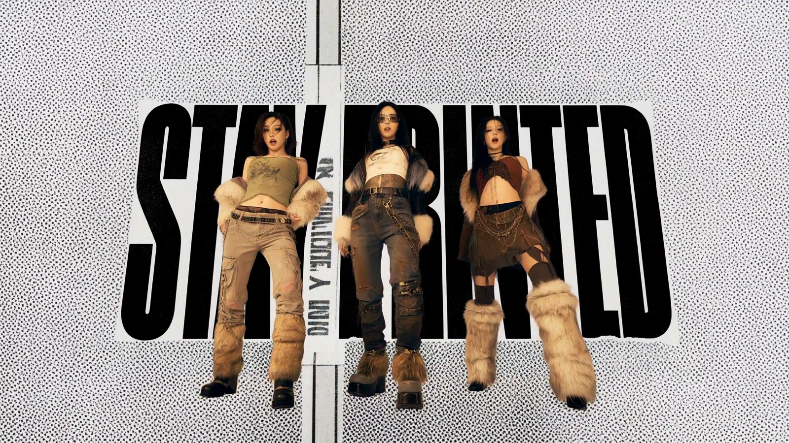
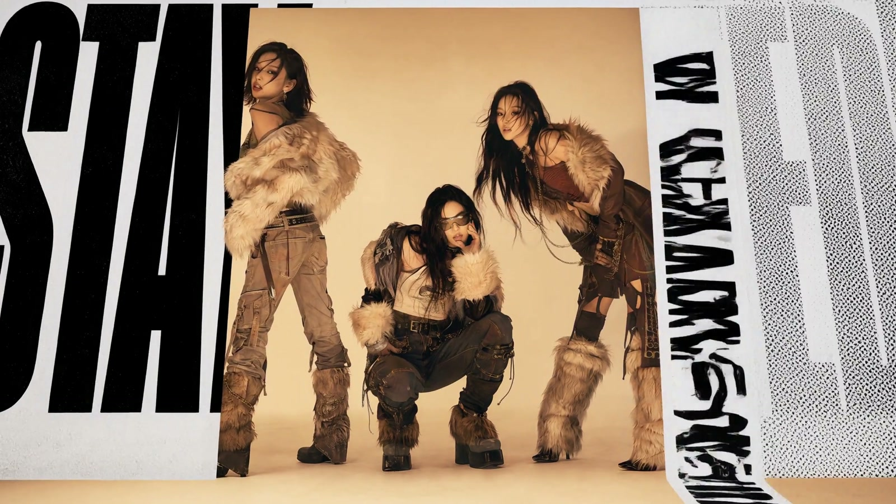
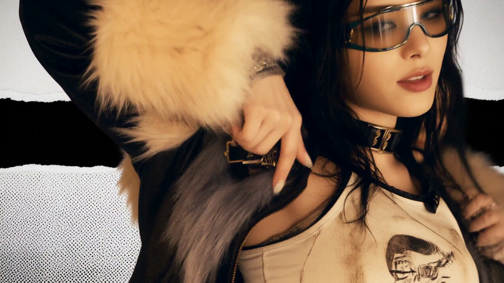

# 复古潮流拼贴音乐短片｜AIGC 视觉实验

我的 AIGC 音乐短片作品。约 15 秒的横屏成片将复古潮流服装、人物舞蹈、撕纸边缘和大幅黑白字体组合在一起，在暖色空间中形成带有杂志拼贴感的视觉表达。

## 成片

[下载完整成片（MP4，约 33 MB）](https://github.com/cyxhrh/project-portfolio/raw/refs/heads/main/aigc-retro-collage/video/retro-collage-music-short.mp4)

提供的是原始 MP4 文件，未重新剪辑或编码，保留原音轨与 AIGC 标识。GitHub 文件页可能不提供大文件内嵌预览，可通过上方链接下载观看。

| 规格 | 数值 |
| --- | --- |
| 时长 | 15.083 秒 |
| 画面 | 2560 × 1440，16:9 横屏 |
| 帧率 | 24 fps |
| 编码 | H.264 / AAC |
| 音频 | 32 kHz，双声道 |

## 画面看点

- **人物与版式结合：** 群舞、近景与大幅字形交替出现，人物既在场景里表演，也成为拼贴构图的一部分。
- **统一的复古色调：** 米色、棕色服装与暖色混凝土空间相互呼应，黑白文字和局部红色形成视觉重点。
- **空间与纸面交错：** 撕纸边缘、网点纹理与倾斜的文字平面穿插在人物镜头之间，形成杂志页面与立体场景相互转换的效果。

以上为根据现有成片整理的视觉观察。

| 拼贴开场 · 0.5 秒 | 人物近景 · 6.0 秒 | 群舞收束 · 14.5 秒 |
| --- | --- | --- |
|  |  |  |

三张图片均直接取自成片，缩放至 1600 × 900，未重新生成或修饰画面。

## 制作信息与收录材料

原文件的 AIGC 元数据将内容生产者标为 **MiniMax**。具体模型版本、提示词、音乐来源及剪辑工具未随本次成片提供；本项先展示成片成果，尚未附生成工程或源码。

- [完整视频](video/retro-collage-music-short.mp4)
- [成片规格、文件哈希与检查记录](docs/verification.json)
- [返回作品集](../README.md)

## 可用于报名的介绍

《复古潮流拼贴音乐短片》是我的 AIGC 视觉创作作品，围绕复古潮流风格，将人物舞蹈、撕纸拼贴和大幅字体组合成约 15 秒的横屏音乐短片。作品集附 2560×1440 原始成片及实帧截图，展示 AI 视频的视觉风格与短片呈现效果。
