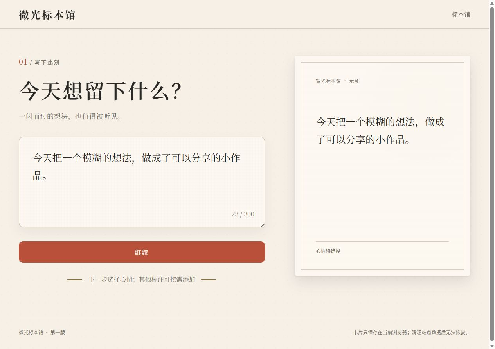
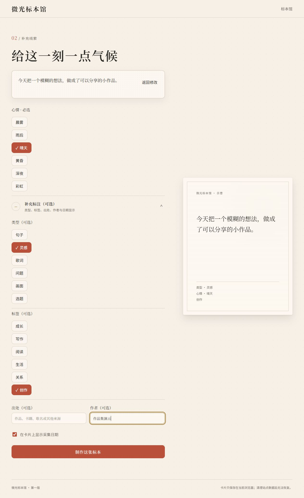
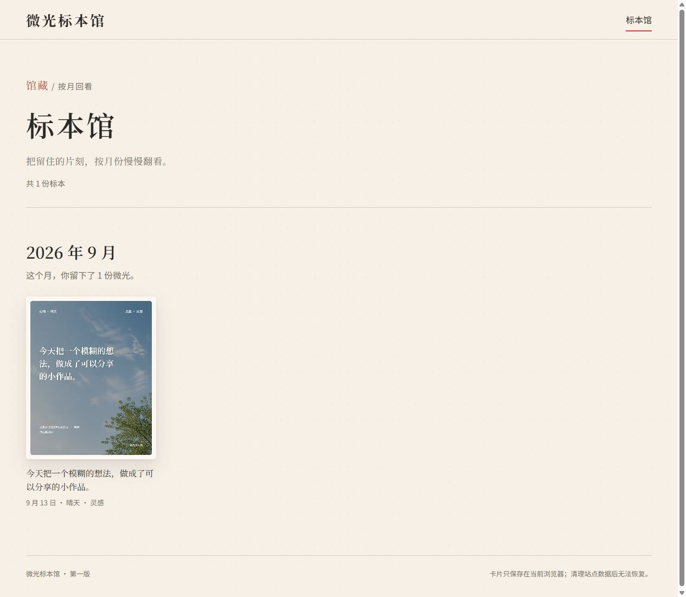

# 微光标本馆｜把一个片刻制成灵感卡片

**[在线体验 · 朋友测试版](https://glimmer-specimen-museum.vercel.app/)**

我担任产品负责人，通过 Codex 协作完成产品取舍、设计、前端实现与验证。应用让用户输入一句话或一个念头，选择心情后生成标本卡，保存到本机馆藏，并按月份回看。

2026-09-13 已在无需登录的浏览器中打开现有站点，实际完成输入、制卡、收藏、刷新保留、月度回看和单卡详情返回。这里是既有朋友测试版，本次未修改或重新部署原项目。

## 页面实图

以下截图来自本次实际操作的线上页面。文字与“作品集演示”作者为本次测试输入，不是真实用户数据或反馈。

### 写下内容，实时预览

### 选择心情，补充标注

### 生成标本卡

### 按月回看

## 已实现的能力

- 两段式输入：正文与心情必填，类型、标签、出处、作者等可选。
- 六种心情、18 张预置背景，可切换同类背景。
- 4:5 卡片与 1080×1350 PNG 输出，带轻量揭晓动画。
- 本机收藏、单卡详情、删除和图片保存入口。
- 月度归档、数量展示，以及详情返回后的列表位置与焦点恢复。

技术栈为 React、TypeScript、Vite、Canvas、IndexedDB、Vitest。产品运行时使用预置素材与浏览器绘图，没有调用 AI 模型生成卡片，也没有后端、登录或跨设备同步。

## 代码与思路

- [运行说明](source/README.md)
- [制作流程](source/src/components/HomeFlow.tsx)
- [Canvas 卡片渲染](source/src/rendering/cardRenderer.ts)
- [IndexedDB 存储](source/src/storage/specimenRepository.ts)
- [月度馆藏与单卡详情](source/src/components/Gallery.tsx)
- [背景与排版配置](source/src/backgrounds/manifest.ts)
- [图片保存与下载回退](source/src/downloading/downloadImage.ts)
- [产品与技术取舍](docs/product-and-technical-decisions.md)

运行源码来自原项目 `3fe9d13b2f9c607a52ca1236ceb46db564bc8245`，逐文件哈希一致。分享内容包含实际运行所需的源码、背景和配置，未复制部署账户绑定、依赖缓存或浏览器中的馆藏数据。

## 验证范围

本次验证的是现有线上体验：无需登录访问、创建一张演示卡片、收藏、刷新后保留、按月查看、进入详情、返回并恢复焦点；未观察到控制台错误。未进行真机手机测试、系统保存窗口落盘或大规模馆藏性能测试。

[2026-07-22 历史 QA 记录](evidence/qa-2026-07-22.md)显示：类型检查、构建及 6 个测试文件中的 25 项测试通过，当时验收范围无开放 P0/P1/P2。历史报告保留其未覆盖项，本次未重跑原项目的构建和自动化测试。

## 报名介绍

微光标本馆是一款将日常灵感、句子与片刻感受制成视觉卡片的网页应用。我负责产品方向与体验取舍，通过 Codex 协作完成设计、实现和验证。用户输入文字、选择心情后，可以生成卡片、下载图片、收入本机标本馆并按月份回看。项目采用 React、TypeScript、Canvas 与 IndexedDB，已提供无需登录的在线测试入口，附源码、实页截图和产品决策说明。
