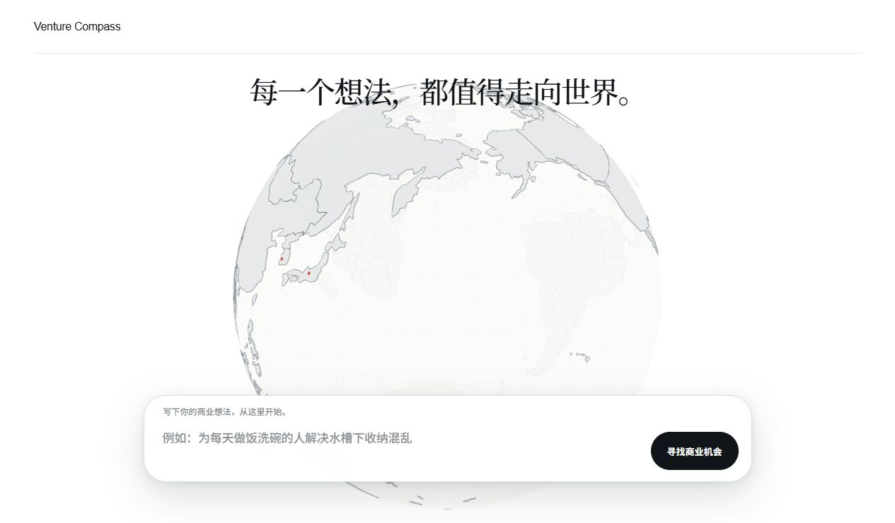
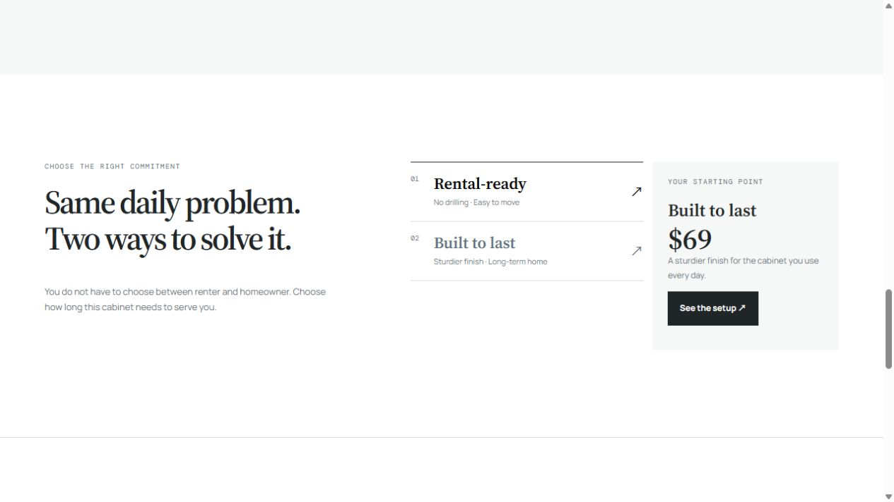

# 商机罗盘 Venture Compass｜比赛最新展示版

本材料采用比赛项目的最新展示版本：`codex/venture-opening-animation`，原提交 `768f39d9079c78fc379d079b2407178b04d66c57`（2026-08-29 10:33 +08:00）。

当前展示流程：开场 Logo 动画 → 3D 全球市场地球与商业想法输入 → 商机分析过渡动画 → SINKSIDE 水槽下收纳产品展示页。

## 真实页面截图

以下图片均于 2026-09-13 从该版本源码生产构建后的本地网页实际操作截取，未重绘界面。

### 1. 地球首页



以“每一个想法，都值得走向世界。”为标题，呈现可旋转地球、全球市场点和悬浮输入区。

### 2. 商业想法输入


本次输入“为每天做饭洗碗的人解决水槽下收纳混乱”，随后点击“寻找商业机会”，页面实际经过过渡动画后跳转至 SINKSIDE。

### 3. SINKSIDE 产品展示首屏


原项目随附的产品视频首屏、场景文案与导航。页面还包含使用场景、收纳前后对比和产品细节。

### 4. 产品方案交互



展示 Rental-ready 与 Built to last 两种方案，可切换查看对应价格和说明；图中是 Built to last 方案。

## 对应代码

- [页面入口与跳转流程](source/src/app/App.tsx)
- [商业想法输入](source/src/components/ResearchForm.tsx)
- [3D 地球](source/src/components/CountryGlobe.tsx)
- [开场动画](source/src/components/OpeningExperience.tsx)
- [商机分析过渡](source/src/components/OpportunityTransition.tsx)
- [SINKSIDE 页面](source/public/sinkside/index.html)
- [SINKSIDE 交互脚本](source/public/sinkside/app.js)
- [项目依赖与运行命令](source/package.json)

`source/public/sinkside/` 内包含原配套图片、视频和样式，保留完整展示所需资源。源码中仍有早期品类、结果和证据抽屉组件，但它们已经不在当前主页面流程中。

## 运行与验证

技术栈：React、TypeScript、Vite、Fluent UI、Three.js / react-globe.gl、Vitest。

在 `source` 目录运行：

```bash
npm ci
npm run dev
```

验证命令：

```bash
npm run test -- --run
npm run build
```

本次验证：**7 个测试文件、37 个测试全部通过；TypeScript 检查与 Vite 生产构建通过。** 已从首页输入、点击、过渡、跳转到 SINKSIDE，并切换产品方案。Vite 提示地球相关构建块较大，构建成功。

源码逐文件 SHA-256 与所选原工作树一致，原项目源码没有改动。本仓库为作品展示用途整理的源码快照，保留运行所需资源，不包含原始开发 Git 历史或依赖缓存。

## 展示范围

本版本是比赛前端概念展示。输入与国家选择目前不会驱动真实市场研究；所有提交都导向预设 SINKSIDE 页面。过渡中的分析文案用于视觉演示，不代表后端 Agent 或实时市场数据已经接通。页面上的商品和价格属于产品概念展示。

## 可粘贴的报名介绍

商机罗盘（Venture Compass）是我参与比赛时制作的商业机会探索网页。我通过 AI Agent 与 Vibe Coding 迭代前端展示，当前版本包含开场动画、可旋转的 3D 全球市场地球、商业想法输入、分析过渡动画，以及 SINKSIDE 产品概念展示页，形成从想法入口到产品呈现的连贯体验。已整理对应源码、页面实图和验证记录；当前为前端展示版本。
