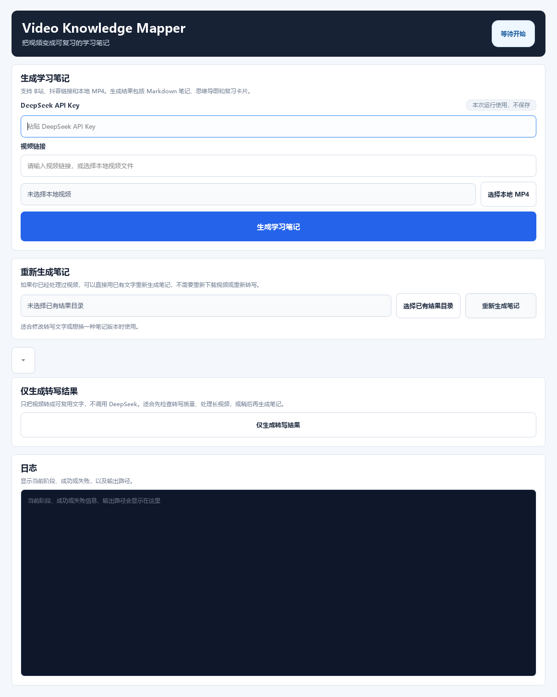

# Video Knowledge Mapper｜视频知识拆解工具

把 B站、抖音链接或本地 MP4 转成可复习的学习笔记。项目源码包含内容获取、转写、AI 笔记生成、Markdown / Mermaid / XMind 输出、复习卡片与飞书同步模块。

## 界面

截图于 2026-09-13 从本包原始 PySide6 界面代码进行离屏渲染。临时环境加载微软雅黑，修复截图中的缺字；渲染过程只屏蔽了启动时创建固定目录的动作，没有修改原项目 UI，也没有填入密钥或触发视频处理。截图展示初始界面，不是一次处理成功的截图。

## 源码入口

- [桌面入口](source/src/vkm/app.py)
- [界面与操作](source/src/vkm/ui/main_window.py)
- [处理流程](source/src/vkm/core/pipeline.py)
- [XMind 输出](source/src/vkm/core/xmind_writer.py)
- [自动化测试](source/tests/)
- [原项目说明](source/README.md)

## 验证与成果

2026-09-13 对本包脱敏源码执行 pytest：**57 passed**。这是自动化测试结果，不表示今天重新验证了平台下载、模型调用或飞书写入。

- [历史两阶段真实使用报告](evidence/two_stage_real_usage_report.md)
- [历史验收清单](evidence/v0_1_acceptance_checklist.md)

本包保留历史报告里的失败和待验收项。运行需要 Python、PySide6、FFmpeg 等依赖；模型调用需要自行配置 Key。飞书目标常量在分享副本中已换成占位符，不能直接同步到原账号。

在 source 目录安装 `requirements.txt` 后，可使用 `python -m pip install -e .`，再执行 `python -m vkm.app`。测试可执行 `python -m pytest`。原项目提供的打包步骤见 [PACKAGING.md](source/PACKAGING.md)。
